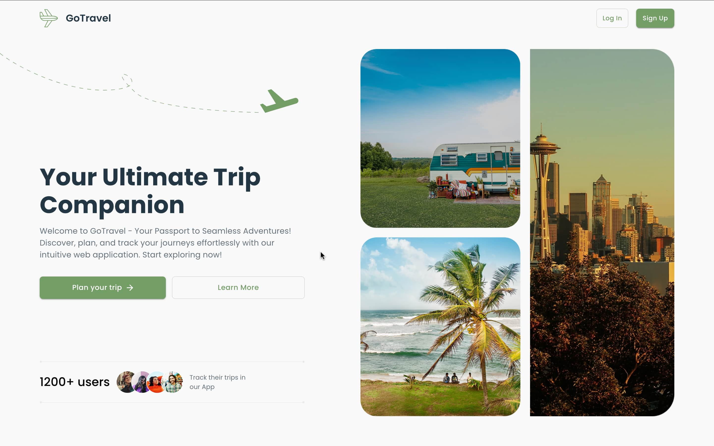
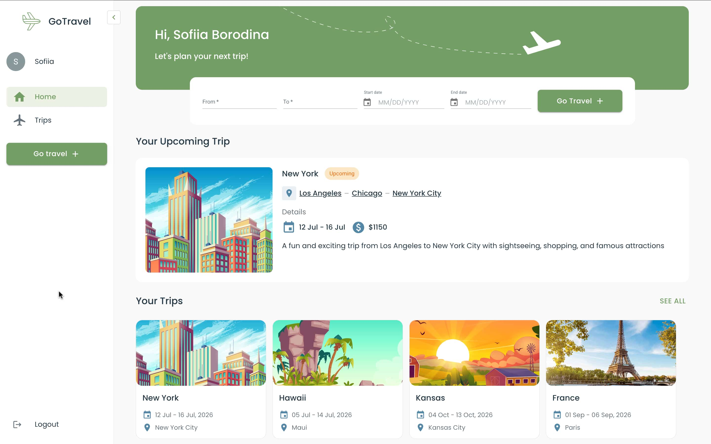
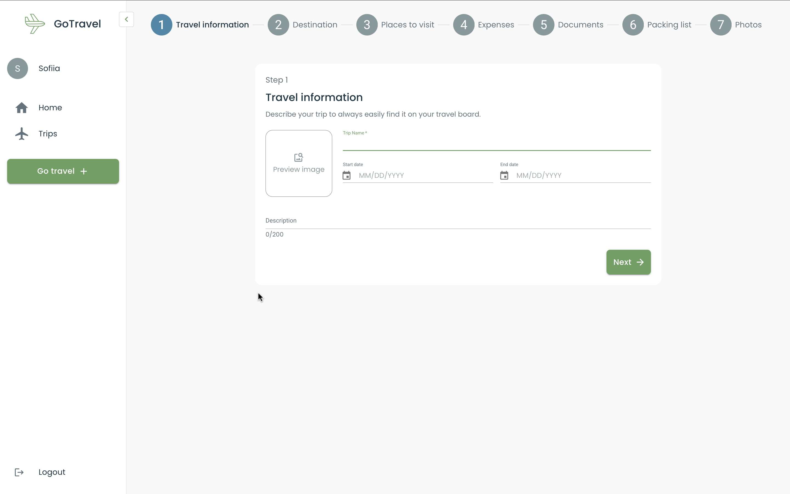
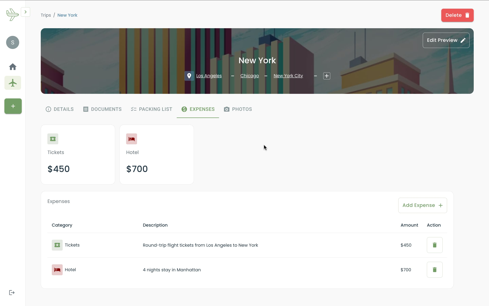
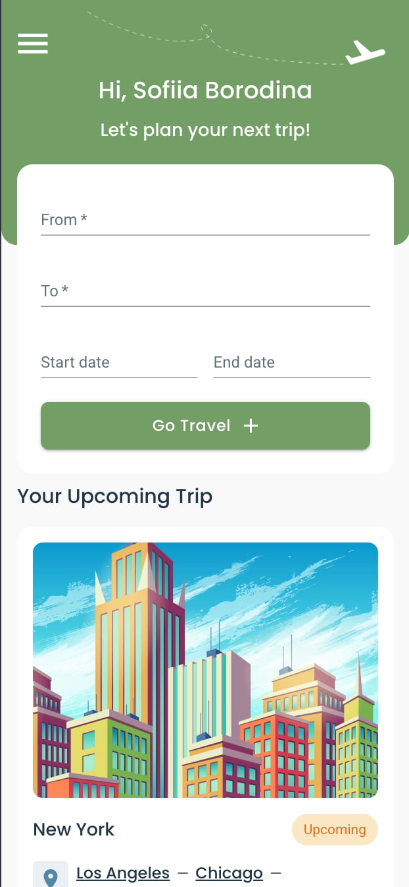

# 🗺️ GoTravel - Smart Travel Planning App

> **Your all-in-one companion for seamless trip planning.** GoTravel helps travelers organize every detail of their journeys - from itineraries and budgets to documents and packing lists - in a single, unified dashboard.

👉 [Watch the live demo](https://www.loom.com/share/0d59785983bc4338ac9f2d0f79082918)

---

## UI Overview

### Landing Page

> Hero section with a call-to-action to start planning - designed to welcome and orient new users.



---

### Dashboard

> A personalized home screen showing upcoming trip and quick-add controls.



---

### Trip Creation Wizard

> A guided 7-step wizard covering travel info, destinations, places to visit, expenses, documents, packing list, and photos.



---

### Expense Tracker

> The Expenses tab within a trip's detail view — log categorized costs, with entries listed in a table and totals reflected in summary cards above.



---

### 📱 Mobile Experience

> Fully responsive layout with adaptive sidebars and mobile-optimized navigation.



---

## Features

- **Multi-step trip wizard** — 7-step guided flow with local storage persistence, so no progress is ever lost
- **Firebase authentication** — Secure sign-up/login with protected routes
- **Real-time sync** — Instant data updates powered by Firestore, with smart cache invalidation via RTK Query tag system
- **Expense & budget tracking** — Add categorized expenses with real-time budget calculations and structured planning views
- **Document & photo management** — Upload, preview, and manage travel files with custom preview image editing and automatic storage cleanup
- **Performance-first UX** — Lazy-loaded routes, error boundaries, Framer Motion animations, and auto-save across all editable sections
- **Responsive SaaS interface** — Pixel-perfect on both desktop and mobile, with adaptive sidebars and smooth navigation patterns

---

## Tech Stack

| Category               | Technologies                               |
| ---------------------- | ------------------------------------------ |
| **Core**               | React, Vite, TypeScript                    |
| **State Management**   | Redux, Redux Toolkit, RTK Query            |
| **Routing**            | React Router DOM                           |
| **Styling**            | Material UI (MUI), Framer Motion           |
| **Forms**              | React Hook Form                            |
| **Backend & Cloud**    | Firebase Auth, Firestore, Firebase Storage |
| **Deployment & CI/CD** | Firebase Hosting, GitHub Actions           |
| **Code Quality**       | ESLint, Prettier                           |
| **Utilities**          | Lodash (debounce)                          |

---

## Project Structure

```
src/
├── app/                  # Core infrastructure — config, hooks, API/Firebase services, Redux store
├── features/             # Self-contained business modules
│   ├── auth/             # Authentication flows
│   ├── dashboard/        # Home dashboard logic and UI
│   ├── landing/          # Public landing experience
│   ├── trip/             # Trip planning and management
│   └── ui/               # Shared feature-level UI components
└── pages/                # Route-level page composition (auth, home, account, fallback)
```

---

## Getting Started

### Prerequisites

- Node.js ≥ 18
- Yarn
- A Firebase project ([create one here](https://console.firebase.google.com/))

### 1. Clone the repository

```bash
git clone https://github.com/borodinka/go-travel.git
cd go-travel
```

### 2. Install dependencies

```bash
yarn
```

### 3. Configure environment variables

Create a `.env` file in the project root:

```env
VITE_FIREBASE_API_KEY=your_api_key
VITE_FIREBASE_AUTH_DOMAIN=your_auth_domain
VITE_FIREBASE_PROJECT_ID=your_project_id
VITE_FIREBASE_STORAGE_BUCKET=your_storage_bucket
VITE_FIREBASE_MESSAGING_SENDER_ID=your_messaging_sender_id
VITE_FIREBASE_APP_ID=your_app_id
```

> You can find these values in your Firebase Console.

### 4. Start the development server

```bash
yarn dev
```

The app will be available at **http://localhost:5173**
